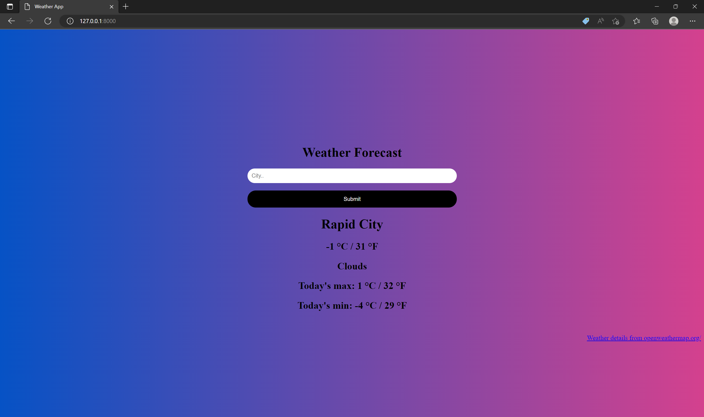

# Django Weather Forecast

This is a weather forecast app built in Django framework. The user can view current weather conditions of any city.

It gets the weather details using an API from https://home.openweathermap.org/.

By default it displays the current weather conditions in Rapid City

## Weather in Seattle

## Weather in Denver

